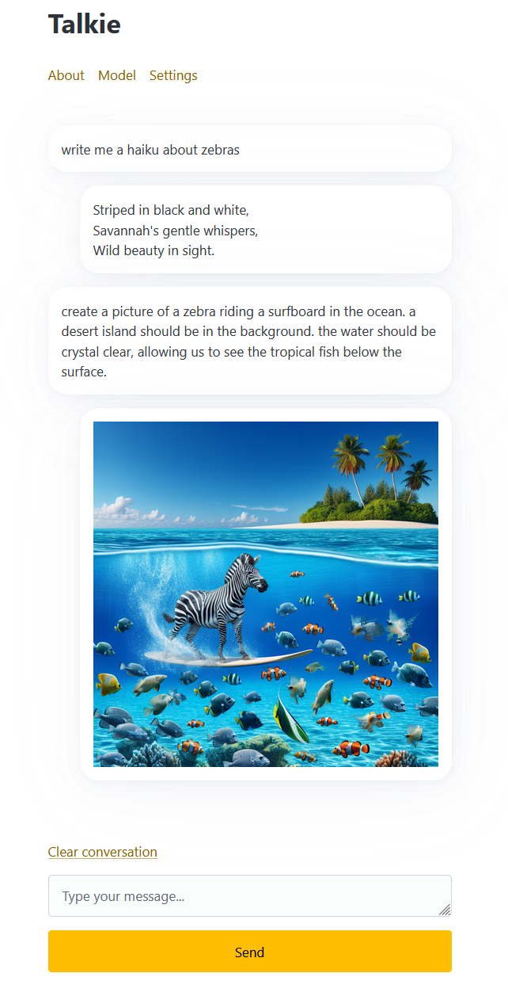

# Talkie

Talkie is minimalist, responsive, local storage, privacy focused interface for LLMs. That means:

 - It is simple and easy to use
 - It should work on any device
 - API keys and settings are stored in your browser only
 - It does not log any chats

I built this because I wanted a tool to interact with LLM APIs that didn't require signups, data collection, and would work everywhere.

Check out the hosted app at https://talkie.dev. 

